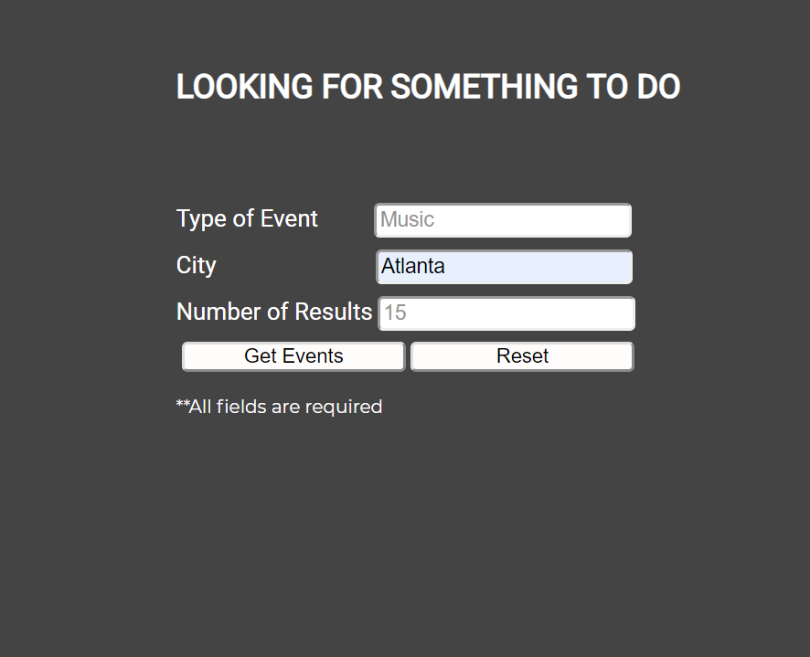
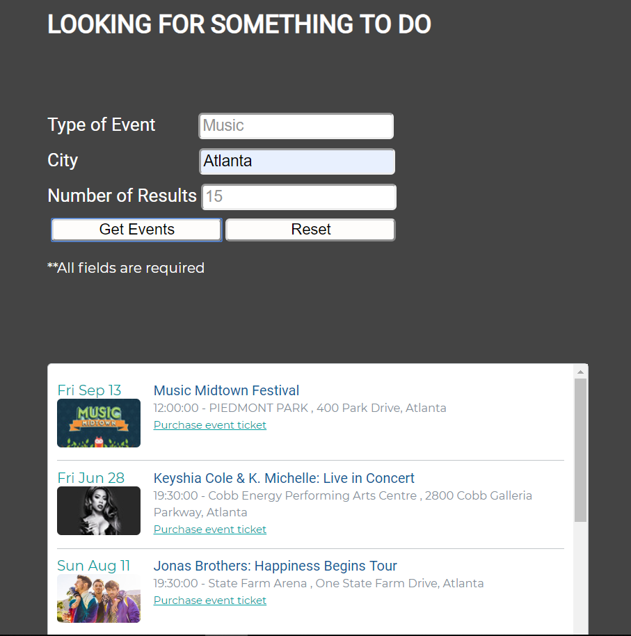

# Event-look-up

Thi is an application that searches for events based on type or genre of event that user is interested in. 

## Motivation 

I wanted to create a 1 step process in looking up paid events without having to look up unnecessary information not pertaining to my interest.

## Live link

https://tenzin1010.github.io/Event-look-up/

## Screenshots

Search Screen: 

Result Screen: The result screen appears with the all results with a scroll bar. 

## Rundown

The app takes 3 required input from the user. 

1. Genre of event: Such as Music, sports. Most paid events are sub-category of either one of those 2, so it covers most search category for users. 

2. City: This field takes in the exact city name, it doesn't have to be a metropolitan location. This category is very precise to where the event is advertised to be held 

3. Results: The default is set to 10 results but the number is up to the user

The results have just enough details about the events. It includes a link if the user chooses to purchase a ticket via ticketmaster. 

The reset button enables the user to remove current result as well as clear the input fields. 

## Tech I used 

- HTML
- CSS
    - Responsive for Desktop, tablet & mobile viewports
- Javascript
    - Reusable functions
- Jquery 
    - Utilized Jquery library to reformat date

